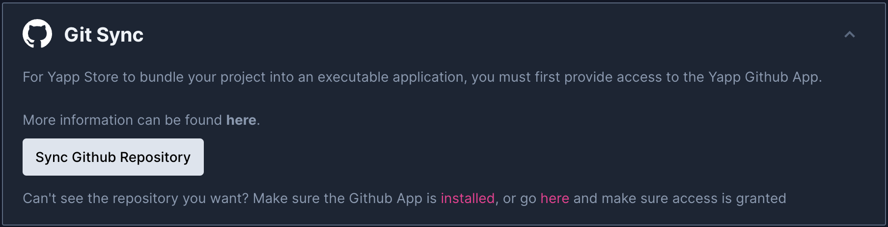
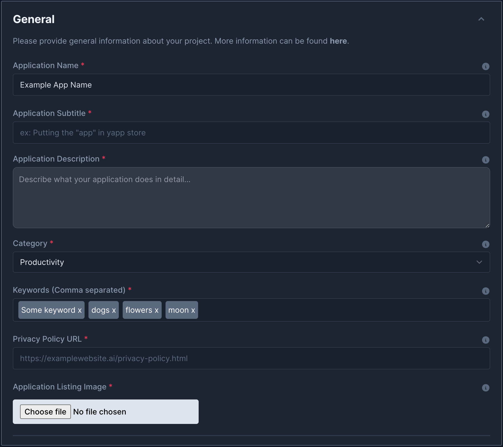
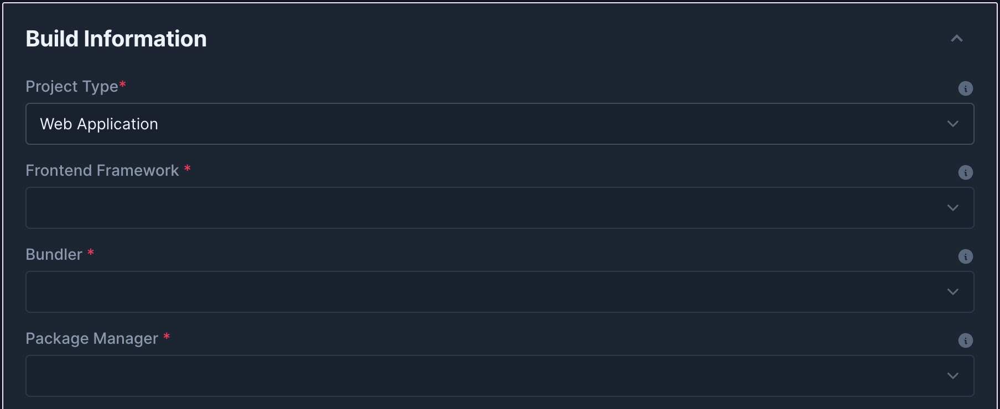
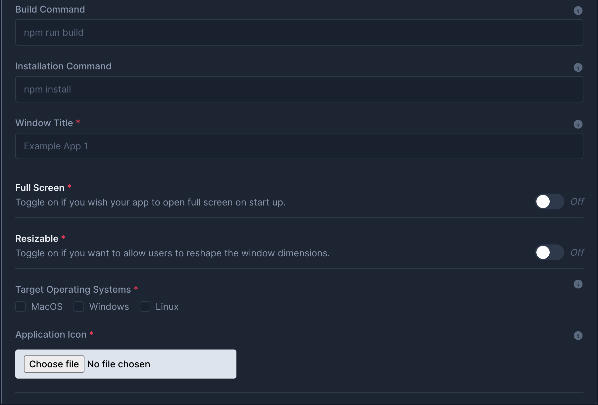
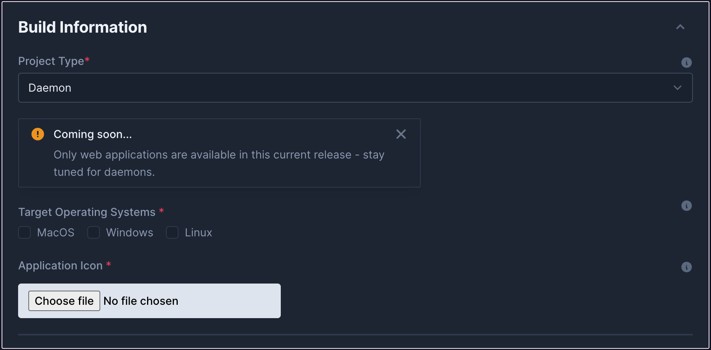
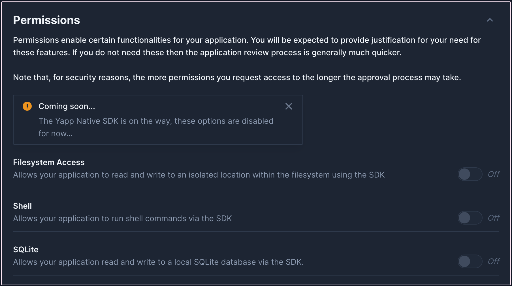
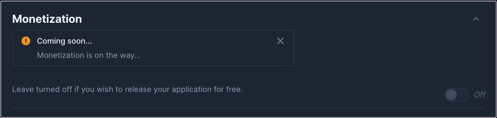
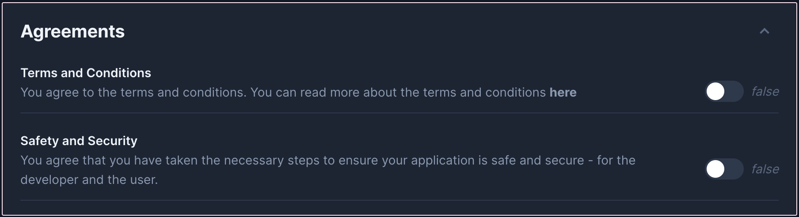

# How To Submit an Application

???+ warning "NOTE"    
    This documentation site is still under construction, so some details may not be included on this page.

Submitting your application to yappstore.ai is a straightforward process. Follow these steps to get your application reviewed and published on our platform. Firstly, go to [**https://developer.yappstore.ai**](https://developer.yappstore.ai) and login with your github account

---

## 1. Syncing your GitHub Repository

To bundle your project into an executable application, you must first provide access to the Yapp GitHub App.

1. **Install the Yapp GitHub App:**
    - Ensure that the Yapp GitHub App is installed in your GitHub account. You can find it [**here**](https://github.com/apps/yappstore-oauth)
    - Grant the necessary permissions for the Yapp GitHub App to access your repository. Click [**here**](https://github.com/settings/installations/) to configure the permissions

2. **Sync Your Repository:**
    - In the App Submission form, click on the "**Sync GitHub Repository**" button.
    - Select the repository you wish to sync. If you can't see your repository, ensure the GitHub App is installed and has access.

???- question ""I Can't Find the Repository I Want""
    If you've just granted access, sometimes Github takes a few minutes to sync the changes - wait 5 minutes and come back.

---

## 2. General Information

Provide the general information about your project. This includes:

- **Application Name**: The name of your application.
- **Application Subtitle**: A brief subtitle (e.g., Putting the "app" in Yapp Store).
- **Application Description**: A detailed description of what your application does.
- **Category**: The category your application belongs to (e.g., Productivity, Education).
- **Keywords**: Comma-separated keywords to help users find your app.
- **Privacy Policy URL**: A link to your application's privacy policy.
- **Application Listing Image**: Upload an image to represent your application in the store.

---

## 3. Build Information

Specify the build information for your project. This helps the YappStore backend to correctly build and bundle your application. There are two applications paradigms in scope for yappstore: UI based applications (Web Applications) and Daemons (background processes that do not need a UI component)

=== "Web Applications"
    
    <!--  -->

    - **Project Type**: Select 'Web Application'.
    - **Frontend Framework**: Choose the framework your application uses (e.g., React, Vue, Angular).
    - **Bundler**: Specify the bundler used in your project (e.g., Webpack, Parcel).
    - **Package Manager**: Select the package manager for your project (e.g., npm, yarn).
    - **Build Command**: The command to build your project (e.g., npm run build).
    - **Installation Command**: The command to install dependencies (e.g., npm install).
    - **Window Title**: The title for your application window.
    - **Full Screen**: Toggle on if you want your app to open in full screen on startup.
    - **Resizable**: Toggle on if you want to allow users to resize the application window.

    
    
    
    
    
    
    
    
    

=== "Daemons"
    
    ???+ question "NOTE"
        This is still in developerment - check back here later.

**Bundle Specific Configurations**

- **Target Operating Systems**: Select the operating systems you want your app to be available on (MacOS, Windows, Linux).
- **Application Icon**: Upload an icon for your application.

---

## 4. Permissions

Permissions enable certain functionalities for your application. These will be reviewed, and you need to justify their necessity.

- **Filesystem Access**: Allows your application to read and write to an isolated location within the filesystem using the SDK.
- **Shell**: Allows your application to run shell commands via the SDK.
- **SQLite**: Allows your application to read and write to a local SQLite database via the SDK.

Note: For security reasons, the more permissions you request, the longer the approval process may take. The Yapp Native SDK is still under development, so these options are currently disabled.

---

## 5. Monetization

Monetization features will be available in future releases. Currently, all applications are released for free.

- **Monetization Toggle**: Leave this turned off to release your application for free.

---

## 6. Agreements

Before submitting your application, you must agree to the following:

- **Terms and Conditions**: Confirm that you have read and agree to the [Terms and Conditions](#).
- **Safety and Security**: Confirm that you have taken the necessary steps to ensure your application is safe and secure for both developers and users.

---

## 7. Submit for Review

Once all the required information is filled out, click on "Submit for Review". We appreciate your feedback on the developer experience, so please leave us any comments or suggestions.

???+ danger "NOTE"    
    By taking part in the MVP, you are agreeing that your application will be freely usable by other testers and users. Do **not** distribute something you would currently like to monetize, as we just not there yet.
    Additionally, we are figuring out licensing and other security aspects for safe and secure distribution. So bear with us. 

---

We hope you had a great developer experience with yappstore.ai. Thank you for your contribution, and we look forward to see what you cook up 🚀
